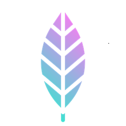

<p align="center">
  
</p>

<h1 align="center">Peacock</h1>

<p align="center">
  Cross-platform LAN file & message transfer tool<br/>
  No server, no internet, no account — just connect and send.
</p>

<p align="center">
  <a href="README_zh.md">简体中文</a> | <strong>English</strong>
</p>

<p align="center">
  
  
  
  
  
</p>

---

## Screenshots

| Snippets | Chat |
|:---:|:---:|
|  |  |

## Features

- **Auto Discovery** — Devices on the same LAN found automatically via UDP broadcast + unicast response
- **Instant Messaging** — Real-time text chat between devices via UDP
- **File Transfer** — Send files and folders with resume support and progress tracking
- **Snippets** — Create, edit, search, and share text snippets with inline quick-copy chips
- **Broadcast-Restricted Device Support** — Devices that cannot broadcast are discovered via restricted peers list
- **Dark Theme** — Follow system or switch manually

## Tech Stack

| Component | Desktop | iOS | Android |
|-----------|---------|-----|---------|
| UI | Vue 3 + TailwindCSS | SwiftUI | Jetpack Compose |
| Backend | Rust + Tauri v2 | Swift | Kotlin |
| Database | SQLite (rusqlite) | SQLite | SQLite |
| Protocol | Custom binary (PCOK header + bincode) | Same | Same |

## How It Works

```
UDP 52000   — Device discovery + messaging + signaling
Dynamic TCP — File data transfer (256KB chunks)
```

Discovery rules:
1. I broadcast → they respond → I add them to device list
2. I receive broadcast → I find myself in their restricted_peers → I add them
3. Receiving a broadcast does NOT add the broadcaster (only send response)

## Platforms

| Platform | Status | Technology |
|----------|--------|-----------|
| Windows | ✅ Released | Tauri v2 (Rust + Vue 3) |
| Linux | ✅ Released | Tauri v2 (Rust + Vue 3) |
| iOS | ✅ App Store | Native Swift / SwiftUI |
| Android | ✅ Released (APK) | Native Kotlin / Compose |
| macOS | 📋 Planned | Swift (shared with iOS) |

## Download

**[GitHub Releases](https://github.com/jlynnc/Peacock/releases/tag/v0.1.0)**

- `peacock.exe` — Windows (portable)
- `Peacock_0.1.0_x64-setup.exe` — Windows (installer)
- `Peacock_0.1.0_amd64.deb` — Linux (Debian/Ubuntu)
- `Peacock-0.1.0-1.x86_64.rpm` — Linux (Fedora/RHEL)
- `Peacock_0.1.0.apk` — Android
- iOS — Search "Peacock" on App Store

## Project Structure

```
desktop/                # Tauri desktop app (Windows + Linux)
├── src/                #   Vue 3 frontend
└── src-tauri/src/      #   Rust backend

apple/                  # iOS app (native Swift)
├── Peacock/            #   SwiftUI views + networking

android/                # Android app (native Kotlin)
├── app/src/main/java/  #   Compose UI + protocol + networking
```

## Building from Source

### Desktop (Windows / Linux)

```bash
cd desktop
npm install
npx tauri dev          # development
npx tauri build        # release
```

### Android

```bash
cd android
./gradlew assembleRelease
```

### iOS

```bash
cd apple
# Open in Xcode, build and run
```

## Support the Project

<p align="center">
  <a href="https://buy.stripe.com/9B67sLfiy1dC1BOcTOaR201">
    
  </a>
</p>

<details>
<summary>Alipay / 支付宝</summary>
<p align="center">
  
</p>
</details>

## License

[MIT](LICENSE)
