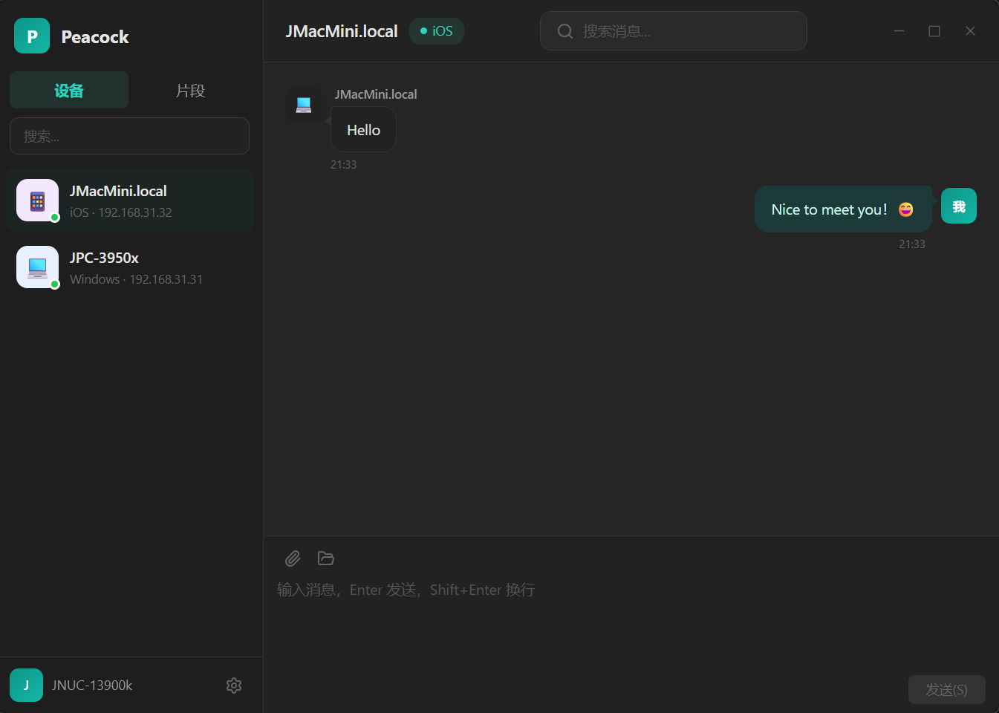

<p align="center">
  
</p>

<h1 align="center">Peacock</h1>

<p align="center">
  Cross-platform LAN file & message transfer tool<br/>
  No server, no internet, no account — just connect and send.
</p>

<p align="center">
  <a href="README_zh.md">简体中文</a> | <strong>English</strong>
</p>

<p align="center">
  
  
  
  
  
</p>

---

## Screenshots

<!-- Replace with actual screenshot paths after capturing -->

| Devices | Chat | File Transfer | Snippets |
|:---:|:---:|:---:|:---:|
|  |  |  |  |

## Highlights

### Quick Copy — Select, Mark, Done

The standout feature of Peacock. When editing a snippet, simply select any text and tap the floating **mark button** to instantly save it as a reusable snippet. No copy-paste, no switching apps — just select and mark.

<!-- Replace with actual screenshot -->
<p align="center">
  
  <br/>
  <em>Select text → Tap the floating mark → Saved as snippet</em>
</p>

Perfect for collecting API keys, code fragments, meeting notes, or any text you need across devices.

## Features

- **Auto Discovery** — Devices on the same LAN are found automatically, zero configuration
- **Instant Messaging** — Real-time text chat between devices with persistent history
- **File Transfer** — Drag & drop files and folders, with resume support and progress tracking
- **Snippets** — Create, edit, search, and share text snippets across devices
- **Quick Copy** — Select any text in a snippet and mark it for instant reuse
- **Bilingual UI** — Chinese / English, auto-detected from system
- **Dark Theme** — Follow system or switch manually

## Tech Stack

| Layer | Technology |
|-------|-----------|
| Frontend | Vue 3 + TypeScript + TailwindCSS 4 |
| Backend | Rust + Tauri v2 |
| Database | SQLite (bundled) |
| Protocol | Custom binary (32-byte header, bincode) |
| Icons | Lucide |

## How It Works

```
UDP 52000   — Device discovery (multicast 224.0.1.100 + broadcast)
TCP 52001   — Messaging / signaling
Dynamic TCP — File transfer (64KB chunks)
```

Discovery strategy: UDP multicast → subnet broadcast → TCP probe → manual IP

## Getting Started

### Prerequisites

- [Node.js](https://nodejs.org/) >= 18
- [Rust](https://rustup.rs/) >= 1.75
- [Tauri CLI](https://tauri.app/) v2

### Development

```bash
# Install dependencies
npm install

# Start dev mode
npm run tauri dev
```

### Build

```bash
# Build release
npx tauri build

# Output (Windows)
src-tauri/target/release/peacock.exe
```

## Platforms

| Platform | Status |
|----------|--------|
| Windows | ✅ Ready |
| macOS | 🚧 In progress |
| iOS | 🚧 In progress |
| Android | 📋 Planned |
| Linux | 📋 Planned |

## Project Structure

```
src/                    # Vue 3 frontend
├── components/         #   UI components (chat, device, snippet, transfer, mobile)
├── stores/             #   Pinia state management
├── types/              #   TypeScript type definitions
├── i18n/               #   Internationalization (zh-CN, en)
└── utils/              #   Utility functions

src-tauri/src/          # Rust backend
├── discovery/          #   Device discovery (UDP/TCP)
├── messaging/          #   Messaging system
├── transfer/           #   File transfer
├── storage/            #   SQLite database
└── protocol/           #   Binary protocol
```

## Support the Project

If you find Peacock useful, consider buying me a coffee!

<p align="center">
  <a href="https://buymeacoffee.com/jlynnc">
    
  </a>
</p>

<!-- Uncomment if you set up other donation platforms:
<p align="center">
  <a href="https://ko-fi.com/YOUR_KOFI"></a>
  <a href="YOUR_WECHAT_QR"></a>
  <a href="YOUR_ALIPAY_QR"></a>
</p>
-->

## License

[MIT](LICENSE)
